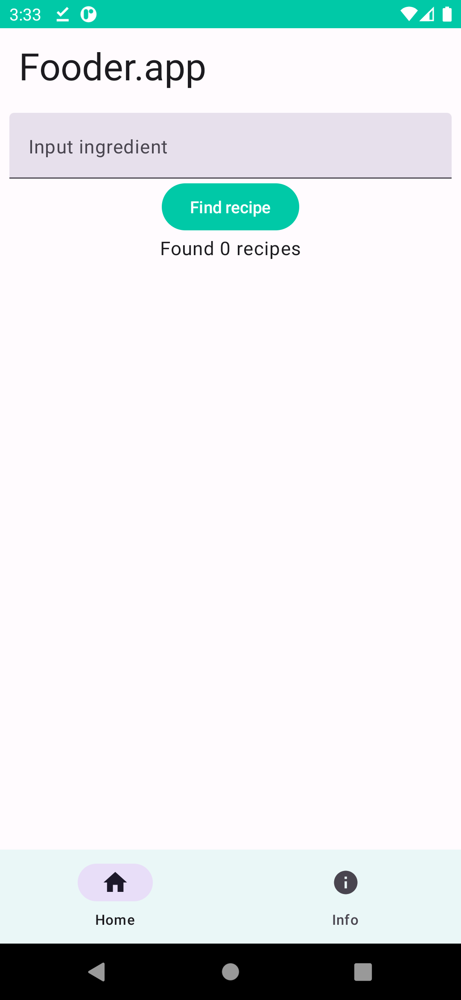
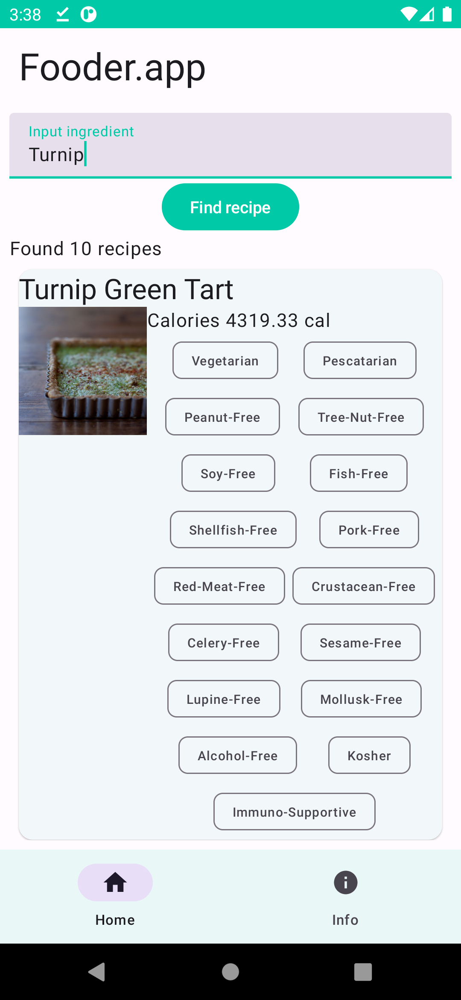
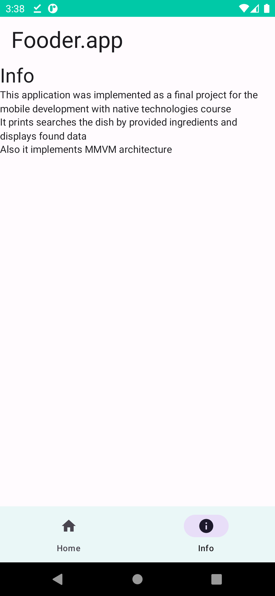

# Fooder.app

## Description

Welcome to Fooder.app! This Android application helps you discover dish names based on the provided ingredients. It leverages the Jetpack Compose framework, Kotlin coroutines, and Retrofit for making API calls. This project was developed as the final assignment for the "Mobile Programming with Native Technologies" course.

| Main view                                    | Results                                      | Info                                         |
| -------------------------------------------- | -------------------------------------------- | -------------------------------------------- |
|  |  |  |

## How to Run

Follow these steps to build and run the project:

1. Create a `gradle.properties` file in the project root directory. This file will be ignored by version control.

2. This application uses the [Edamam Recipe API](https://developer.edamam.com/edamam-recipe-api). To utilize the API, you need to register and obtain API keys.

3. Inside the `gradle.properties` file, add your API keys like this:

```gradle
# Project-wide Gradle settings.
# IDE (e.g. Android Studio) users:
# Gradle settings configured through the IDE *will override*
# any settings specified in this file.
# For more details on how to configure your build environment visit
# http://www.gradle.org/docs/current/userguide/build_environment.html
# Specifies the JVM arguments used for the daemon process.
# The setting is particularly useful for tweaking memory settings.
org.gradle.jvmargs=-Xmx2048m -Dfile.encoding=UTF-8
# When configured, Gradle will run in incubating parallel mode.
# This option should only be used with decoupled projects. More details, visit
# http://www.gradle.org/docs/current/userguide/multi_project_builds.html#sec:decoupled_projects
# org.gradle.parallel=true
# AndroidX package structure to make it clearer which packages are bundled with the
# Android operating system, and which are packaged with your app's APK
# https://developer.android.com/topic/libraries/support-library/androidx-rn
android.useAndroidX=true
# Kotlin code style for this project: "official" or "obsolete":
kotlin.code.style=official
# Enables namespacing of each library's R class so that its R class includes only the
# resources declared in the library itself and none from the library's dependencies,
# thereby reducing the size of the R class for that library
android.nonTransitiveRClass=true

APP_KEY="Your key from api here"
APP_ID="Your key from api here"
```

After that you will be able to build the project and run the app
